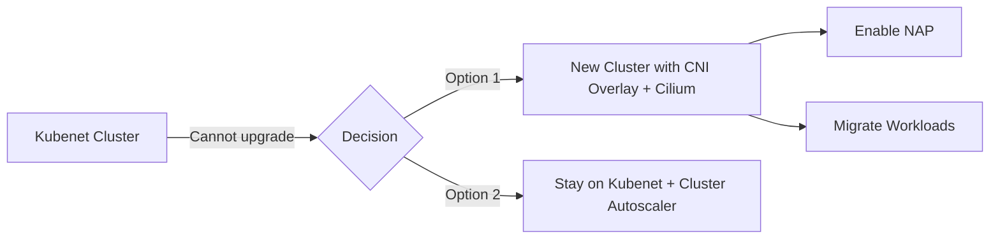
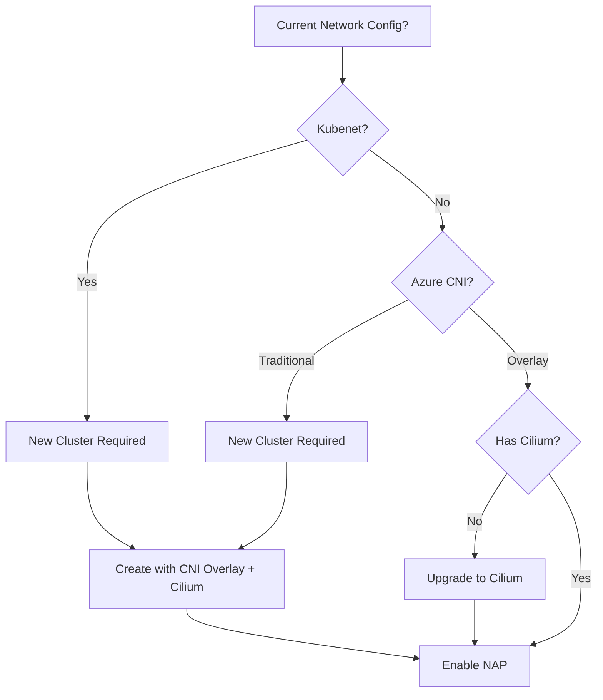

# AKS Network Configuration & Karpenter Compatibility Guide

> **Updated:** January 2026  
> **Purpose:** Network compatibility scenarios, migration paths, and cost analysis

---

## Karpenter/NAP Status Update

| Milestone | Date |
|-----------|------|
| Preview Launched | December 2023 |
| **General Availability** | **July 2025** ✅ |
| Current Status | **Production Ready** |

> [!NOTE]
> NAP is now GA. The `node_provisioning_mode` attribute should be available in azurerm provider 4.x releases after July 2025. Check for updates if your provider version doesn't support it.

---

## Network Plugin Comparison Matrix

| Feature | Kubenet | Azure CNI | Azure CNI Overlay | Azure CNI + Cilium |
|---------|---------|-----------|-------------------|-------------------|
| **Pod IP Source** | Internal NAT | VNet subnet | Private CIDR | Private CIDR + eBPF |
| **VNet IP Usage** | Low | High | Low | Low |
| **Max Nodes** | 400 | 1000+ | 1000+ | 1000+ |
| **Windows Support** | ❌ | ✅ | ✅ | ❌ |
| **Network Policy** | Calico only | Azure/Calico | Azure/Calico/Cilium | Cilium |
| **Karpenter/NAP** | ❌ | ❌ | ⚠️ Requires Cilium | ✅ |
| **Best For** | Dev/Test | Enterprise VNet | Large clusters | Karpenter + observability |

---

## Karpenter Compatibility

### ✅ Supported Configuration

```bash
az aks create \
  --network-plugin azure \
  --network-plugin-mode overlay \
  --network-dataplane cilium
```

| Requirement | Value |
|-------------|-------|
| Network Plugin | Azure CNI |
| Plugin Mode | Overlay |
| Data Plane | Cilium |
| Identity | System-assigned or User-assigned Managed Identity |
| Node OS | Linux only |

### ❌ Incompatible Configurations

| Configuration | Why Not Supported |
|---------------|-------------------|
| **Kubenet** | No direct pod routing, UDR limits |
| **Azure CNI (Traditional)** | Requires Overlay mode |
| **Calico** | NAP requires Cilium |
| **Windows Nodes** | Not supported by Karpenter |
| **IPv6** | Not supported |
| **Service Principal** | Must use Managed Identity |

---

## Migration Scenarios

### Scenario 1: Kubenet → Karpenter

**Current State:** Cluster using Kubenet  
**Goal:** Enable Karpenter/NAP  

**Path:** ⚠️ **Requires new cluster**



**Steps:**
1. Create new AKS cluster with Azure CNI Overlay + Cilium
2. Enable NAP: `az aks update -n <cluster> -g <rg> --node-provisioning-mode Auto`
3. Migrate workloads using blue-green or canary deployment
4. Decommission old cluster

**Estimated Effort:** 2-4 weeks  
**Risk:** Medium (workload migration required)

---

### Scenario 2: Azure CNI (Traditional) → Karpenter

**Current State:** Cluster using Azure CNI  
**Goal:** Enable Karpenter/NAP  

**Path:** ⚠️ **Requires new cluster**

> [!WARNING]
> You cannot upgrade network plugin mode in-place. A new cluster is required.

**Why Migration is Needed:**
- Traditional Azure CNI assigns VNet IPs directly to pods
- Overlay mode uses a separate pod CIDR
- This is a fundamental architectural difference

**Steps:**
1. Create new cluster with `--network-plugin-mode overlay --network-dataplane cilium`
2. Enable NAP
3. Migrate PVCs, ConfigMaps, Secrets
4. Update DNS/Load Balancers to point to new cluster

---

### Scenario 3: Azure CNI Overlay → Karpenter

**Current State:** Cluster using Azure CNI Overlay (without Cilium)  
**Goal:** Enable Karpenter/NAP  

**Path:** ✅ **In-place upgrade possible**

```bash
# Upgrade data plane to Cilium
az aks update -n <cluster> -g <rg> --network-dataplane cilium

# Enable NAP
az aks update -n <cluster> -g <rg> --node-provisioning-mode Auto
```

**Estimated Effort:** 1-2 hours  
**Risk:** Low (brief control plane update)

---

#### Technical Implications: Enabling Cilium on Azure CNI Overlay

When upgrading from Azure CNI Overlay to Azure CNI Overlay + Cilium, understand these key changes:

##### Pod CIDR / Subnet / VNet Impact

| Aspect | Before (Overlay) | After (Overlay + Cilium) | Change Required |
|--------|------------------|--------------------------|-----------------|
| **Pod CIDR** | `10.244.0.0/16` (default) | Same | ❌ No change |
| **VNet Subnet** | Unchanged | Unchanged | ❌ No change |
| **Node Subnet** | Unchanged | Unchanged | ❌ No change |
| **Service CIDR** | `10.0.0.0/16` (default) | Same | ❌ No change |

> [!NOTE]
> **Good news:** Enabling Cilium does NOT change your pod CIDR, VNet, or subnet configuration. The overlay addressing remains the same.

##### What DOES Change

| Component | Before | After | Impact |
|-----------|--------|-------|--------|
| **Data Plane** | Azure native | Cilium eBPF | Performance improvement |
| **kube-proxy** | Running | Removed | Cilium handles service routing |
| **Network Policy Engine** | Azure NPM/Calico | Cilium | Policy behavior differences |
| **Pod Networking** | VXLAN encap | Cilium direct routing | Lower latency |

##### Node Reimaging Process


> [!WARNING]
> **During upgrade:** Each node pool is reimaged (rolling). Expect:
> - Pods rescheduled as nodes are drained
> - ~5-10 minutes per node pool
> - Brief temporary policy inconsistency until all nodes complete

##### Network Policy Compatibility

**Critical differences between Azure NPM and Cilium:**

| Scenario | Azure NPM | Cilium | Action Needed |
|----------|-----------|--------|---------------|
| `ipBlock` targeting Pod IPs | Allowed | ❌ Blocked | Refactor to use `podSelector` |
| `ipBlock` targeting Node IPs | Allowed | ❌ Blocked | Refactor to use `nodeSelector` |
| Egress to local node IP | Implicitly allowed | ❌ Blocked | Add explicit egress rule |
| Empty `podSelector` | Matches all pods | Same | ✅ No change |
| L7 policies | Not supported | Not supported (in AKS) | N/A |

**Pre-migration checklist:**
```bash
# List all network policies
kubectl get networkpolicies -A

# Check for ipBlock rules (may need modification)
kubectl get networkpolicies -A -o yaml | grep -A5 "ipBlock"
```

##### Example: Policy That Needs Modification

**Before (works with NPM, fails with Cilium):**
```yaml
apiVersion: networking.k8s.io/v1
kind: NetworkPolicy
metadata:
  name: allow-from-nodes
spec:
  podSelector: {}
  ingress:
    - from:
        - ipBlock:
            cidr: 10.224.0.0/16  # Node IP range - WON'T WORK
```

**After (works with Cilium):**
```yaml
apiVersion: networking.k8s.io/v1
kind: NetworkPolicy
metadata:
  name: allow-from-nodes
spec:
  podSelector: {}
  ingress:
    - from:
        - namespaceSelector: {}  # Allow from any namespace
          podSelector: {}        # Any pod (including daemonsets on nodes)
```

##### Verification Commands

```bash
# Check Cilium status
kubectl get pods -n kube-system -l k8s-app=cilium

# Verify no kube-proxy
kubectl get pods -n kube-system | grep kube-proxy  # Should return nothing

# Check network dataplane
az aks show -n <cluster> -g <rg> --query "networkProfile.networkDataplane"
```

### Scenario 4: Already on Azure CNI + Cilium

**Current State:** Cluster using Azure CNI Overlay + Cilium  
**Goal:** Enable Karpenter/NAP  

**Path:** ✅ **Simple enablement**

```bash
az aks update -n <cluster> -g <rg> --node-provisioning-mode Auto
```

**Estimated Effort:** 15 minutes  
**Risk:** Very Low

---

## Cost Analysis

### Cilium Pricing

| Tier | Cost | Features |
|------|------|----------|
| **Open Source** | **Free** | eBPF networking, basic policy, kube-proxy replacement |
| **Enterprise** | ~$600-1000/node/year | L7 policies, Hubble observability, enterprise support |

> [!TIP]
> Azure CNI Powered by Cilium uses the **open-source** version at no additional cost. You only pay for underlying Azure infrastructure.

### Karpenter (NAP) Pricing

| Component | Cost |
|-----------|------|
| **NAP Add-on** | **Free** (included in AKS) |
| **Nodes Provisioned** | Standard Azure VM pricing |
| **Spot Nodes** | 60-90% discount |

### Total Cost Comparison (100-node cluster)

| Configuration | Monthly Estimate | Notes |
|---------------|------------------|-------|
| Cluster Autoscaler + Standard VMs | $15,000 | Baseline |
| NAP + Spot VMs (70% spot) | $7,500 | ~50% savings via spot |
| NAP + Spot + Cilium Enterprise | $12,500 | Observability but higher node cost |

### Cost Optimization Tips

1. **Use Open-Source Cilium** - Enterprise features rarely needed for most workloads
2. **Maximize Spot usage** - NAP's flexible SKU selection handles evictions better
3. **Enable Consolidation** - NAP automatically consolidates underutilized nodes
4. **Right-size pods** - Better bin-packing = fewer nodes needed

---

## Decision Tree



---

## Quick Reference Commands

### Check Current Network Configuration
```bash
az aks show -n <cluster> -g <rg> --query "networkProfile"
```

### Create NAP-Compatible Cluster
```bash
az aks create \
  -n aks-nap-ready \
  -g rg-aks \
  --network-plugin azure \
  --network-plugin-mode overlay \
  --network-dataplane cilium \
  --node-provisioning-mode Auto
```

### Enable NAP on Existing Compatible Cluster
```bash
az aks update -n <cluster> -g <rg> --node-provisioning-mode Auto
```

### Verify NAP Status
```bash
kubectl get nodepools.karpenter.sh
kubectl get aksnodeclasses.karpenter.azure.com
```

---

## Related Documentation

- [Scaled Spot Orchestration Guide](SCALED_SPOT_ORCHESTRATION.md)
- [AKS Spot Node Architecture](AKS_SPOT_NODE_ARCHITECTURE.md)
- [Karpenter NAP Prototype](../terraform/prototypes/aks-nap/)

---

*Document created January 2026*
